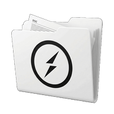
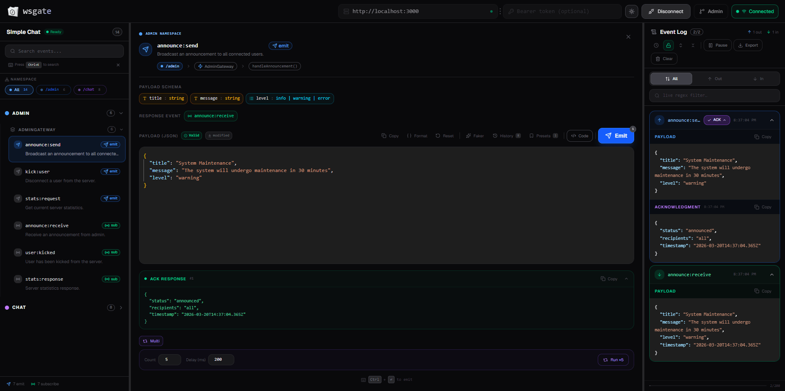

<div align="center">



# wsgate

**Interactive Swagger-like UI for NestJS Socket.IO Gateway Events**

[](https://www.npmjs.com/package/@wsgate/nest)
[](https://www.npmjs.com/package/@wsgate/nest)
[](LICENSE)
[](https://nestjs.com)
[](https://www.typescriptlang.org)

</div>

<br/>

NestJS has `@nestjs/swagger` for REST. Socket.IO gateways have nothing.

`wsgate` adds a browser UI — like Swagger UI but for your WebSocket events. It auto-discovers every `@SubscribeMessage()` decorated with `@WsDoc()` and lets you emit events, inspect payloads, and watch live responses — without writing a single test client.

[](./images/showcase-1.png)

---

## Packages

| Package                                     | Description                                       | npm                                                                                                               |
| ------------------------------------------- | ------------------------------------------------- | ----------------------------------------------------------------------------------------------------------------- |
| [`@wsgate/nest`](./packages/nest/README.md) | NestJS adapter — decorators, explorer, module     | [](https://www.npmjs.com/package/@wsgate/nest) |
| [`@wsgate/ui`](./packages/ui/README.md)     | React UI — served automatically by `@wsgate/nest` | [](https://www.npmjs.com/package/@wsgate/ui)     |

---

## Quick Start

```bash
pnpm add @wsgate/nest
```

**`app.module.ts`**

```typescript
import { DiscoveryModule } from "@nestjs/core";
import { WsgateExplorer } from "@wsgate/nest";

@Module({
  imports: [DiscoveryModule, ChatModule],
  providers: [WsgateExplorer],
})
export class AppModule {}
```

**`main.ts`**

```typescript
import { WsgateModule } from "@wsgate/nest";

await WsgateModule.setup("/wsgate", app, { title: "My App" });
await app.listen(3000);
// → http://localhost:3000/wsgate
```

**Gateway**

```typescript
import { WsDoc } from "@wsgate/nest";

@WsDoc({
  event: "message:send",
  description: "Send a message to a room.",
  payload: { room: "string", text: "string" },
  response: "message:receive",
  type: "emit",
})
@SubscribeMessage("message:send")
handleSendMessage(@MessageBody() data: { room: string; text: string }) {}
```

For full usage see [`@wsgate/nest` docs](./packages/nest/README.md).

---

## Monorepo Structure

```
wsgate/
├── packages/
│   ├── nest/        → @wsgate/nest  (NestJS adapter)
│   └── ui/          → @wsgate/ui    (React UI)
├── examples/
│   └── nest-example/             (NestJS example)
├── package.json     (workspace root)
└── pnpm-workspace.yaml
```

---

## Local Development

```bash
# Install all dependencies
pnpm install

# Build UI
pnpm --filter @wsgate/ui build

# Build nest
pnpm --filter @wsgate/nest build

# Run example app
pnpm --filter nest-example start:dev
# → http://localhost:3000/wsgate
```

---

## Contributing

See [CONTRIBUTING.md](./CONTRIBUTING.md) for guidelines.
Package-specific guides: [nest](./packages/nest/CONTRIBUTING.md) · [ui](./packages/ui/CONTRIBUTING.md)

Open an issue before a large PR.

## License

MIT — see [LICENSE](./LICENSE) for details.

---

<div align="center">
<b>If this saved you from writing another throwaway test client, drop a ⭐</b>
</div>
