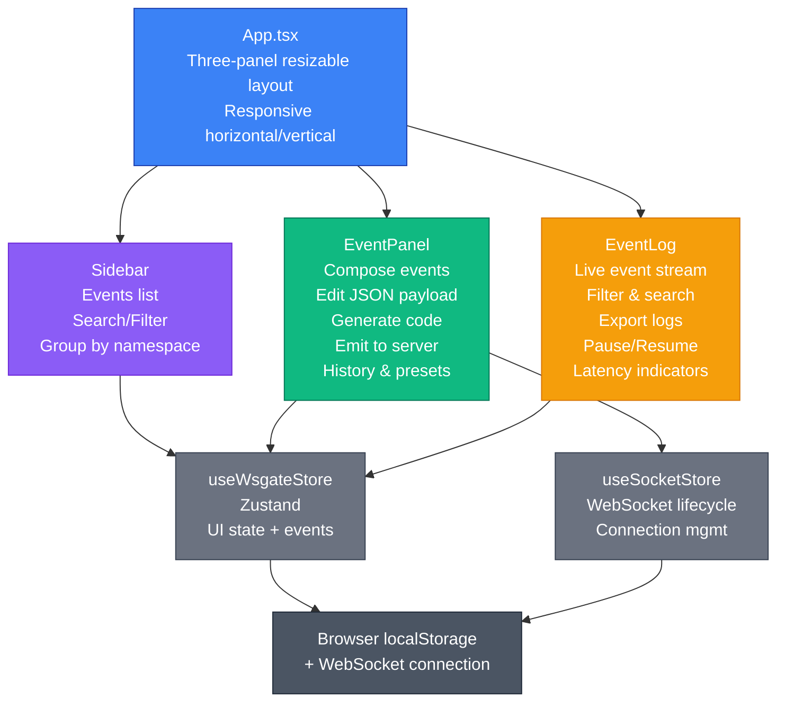

<div align="center">
  
  <br>
  <br>
  <h1>🚀 WSGate UI</h1>
  <p><em>A Modern WebSocket Gateway Interface</em></p>
</div>

## Overview

The **nestjs-wsgate** UI is a real-time WebSocket event explorer and debugger. It helps developers discover, compose, and test WebSocket events exposed by a NestJS application via the `@WsDoc()` decorator.

### Core Architecture



---

## State Management

### `useWsgateStore` (Zustand)

**Location**: `src/store/wsgate.store.ts`

Centralized state for UI configuration and event data.

#### Persisted State

- `url` — WebSocket server address (e.g., "ws://localhost:3000")
- `token` — Authentication token (Base64 encoded)
- `selectedEvent` — Currently selected event for composition
- `selectedNamespace` — Filtered namespace (e.g., "/chat", "/admin")
- `logs` — Array of emitted/received event log entries
- `acks` — ACK (acknowledgment) responses from server

#### Volatile State (session-only)

- `showExportMenu`, `showFakerVars`, `showCodeGen` — UI panel toggles
- `selectedEventIndex` — Current position in log

#### Actions

- `setUrl()`, `setToken()` — Connection config
- `setSelectedEvent()` — Switch active event for composition
- `addLog()` — Record an emitted or received event
- `addAck()` — Store server acknowledgment
- `clearLogs()` — Reset event history
- `updateLog()` — Modify log metadata (pinned, star, etc.)

**Usage Example:**

```tsx
const { selectedEvent, setSelectedEvent, logs, addLog } = useWsgateStore();

// Switch to an event
setSelectedEvent({ event: "user.created", type: "emit", ... });

// Record an emission
addLog({
  direction: "out",
  event: "user.created",
  payload: { id: 123 },
  timestamp: new Date().toISOString(),
});
```

### `useSocketStore` (WebSocket Lifecycle)

**Location**: `src/hooks/useSocket.ts`

Manages WebSocket connection, event listening, and server communication.

#### Status States

- `disconnected` — No connection
- `connecting` — Attempting connection
- `connected` — Active connection
- `error` — Connection failed

#### Actions

- `connect(url, token)` — Establish WebSocket connection
- `disconnect()` — Close connection gracefully
- `emit(namespace, event, payload)` — Send event to server

**Usage Example:**

```tsx
const { status, connect, disconnect, emit } = useSocketStore();

// Connect on component mount
useEffect(() => {
  if (token && url) {
    connect(url, token);
  }
}, [token, url]);

// Emit an event
const sendEvent = () => {
  emit(selectedEvent.namespace, selectedEvent.event, payload);
};
```

---

## Component Hierarchy

### `Navbar.tsx` — Connection & Settings

- Manages WebSocket URL and authentication token
- Connect/Disconnect button with status indicator
- Namespace picker for filtering events
- Theme toggle (light/dark)
- **Never re-renders** other panels—only updates stores

### `Sidebar.tsx` — Event Discovery

- Fetches all events from `/wsgate/events` endpoint after connection
- Groups events by namespace, then by gateway
- Provides search/filter by event name or description
- Clicking an event calls `setSelectedEvent()` in the store

### `EventPanel.tsx` — Event Composition

- **Monaco Editor** for JSON payload editing with:
  - Real-time JSON validation against event schema
  - Faker variable completions (`{{$randomInt}}`, `{{$randomFirstName}}`, etc.)
  - Syntax highlighting in dark VSCode theme
  - Auto-formatting (Ctrl+Shift+F)
- **Sub-panels**:
  - `CodeGenPanel` — Generate client code (9+ languages)
  - `HistoryDropdown` — Access saved payloads
  - `PresetsDropdown` — Save/load custom payload templates
  - `FakerVarsPanel` — Browse available faker variables
  - `MultiEmitPanel` — Batch emit with delay/repeat
- Emit button triggers `useSocketStore.emit()`
- ACK responses displayed in collapsible `AckPanel`

### `EventLog.tsx` — Live Event Stream

- Displays all emitted and received events in real-time
- Each log entry is expandable (`LogEntry.tsx`)
- Interactive features:
  - **Pause/Resume** — Freeze log to inspect old events
  - **Filter** — By direction (emit/receive), event type, namespace
  - **Search** — Full-text search across event names
  - **Pin/Star** — Highlight important events
  - **Export** — Download logs as JSON, CSV, or other formats
  - **Latency indicator** — RTT from emit to ACK/receive

---

## Data Flow

### 1. Event Discovery

```
User clicks "Connect"
    ↓
Navbar: connect(url, token)
    ↓
useSocketStore: Establish WebSocket
    ↓
Sidebar: Fetch /wsgate/events
    ↓
Parse events, group by namespace
    ↓
Render event tree
```

### 2. Compose & Emit

```
User selects event from Sidebar
    ↓
setSelectedEvent() → useWsgateStore
    ↓
EventPanel: Load event schema
    ↓
User edits JSON in Monaco
    ↓
User clicks "Emit"
    ↓
useSocketStore.emit(namespace, event, payload)
    ↓
WebSocket.send()
    ↓
addLog({ direction: "out", ... })
    ↓
EventLog: Display emission
    ↓
Server processes, sends back ACK or event
    ↓
addLog() + addAck()
    ↓
EventLog: Display response + latency
```

### 3. Faker Variable Resolution

```
User types {{ in editor
    ↓
Monaco: Trigger completion provider
    ↓
buildFakerCompletions() returns suggestions
    ↓
User selects {{$randomFirstName}}
    ↓
User clicks "Emit"
    ↓
resolveFakerVars(jsonStr) replaces all {{$var}} → random values
    ↓
emit({ name: "Alice", ... })
```

---

## Key Libraries & Patterns

### React Patterns

- **Hooks**: `useState`, `useEffect`, `useCallback`, `useRef`, `useMemo`
- **No prop drilling**: All state via Zustand stores
- **Responsive design**: Media queries for mobile/tablet/desktop

### UI Library

- **Tailwind CSS** — Utility-first styling with light/dark themes
- **Lucide React** — Icon library (40+ icons used)
- **React Resizable Panels** — Draggable panel splitters
- **Monaco Editor** — JSON editing with language features

### State Management

- **Zustand** — Lightweight store with localStorage persistence
- **React Query** (if needed) — Can be added for server data fetching

### Data Validation & Code Gen

- **JSON Schema** — Monaco validates payloads against event schema
- **@types/node** — TypeScript support

---

## File Organization

```
src/
├── App.tsx                     # Root layout (3-panel resizable)
├── main.tsx                    # React 18 entry point
│
├── components/
│   ├── Navbar.tsx              # Top nav: URL, token, namespace, theme
│   ├── Sidebar.tsx             # Event list + search/filter
│   ├── EventPanel.tsx          # Main event editor + composer
│   ├── EventLog.tsx            # Live event stream
│   │
│   ├── sub-components/         # Reusable UI blocks
│   │   ├── CodeGenPanel.tsx
│   │   ├── HistoryDropdown.tsx
│   │   ├── PresetsDropdown.tsx
│   │   ├── FakerVarsPanel.tsx
│   │   ├── MultiEmitPanel.tsx
│   │   ├── AckPanel.tsx
│   │   ├── LogEntry.tsx
│   │   ├── EventRow.tsx
│   │   ├── CopyButton.tsx      # Icon button + clipboard
│   │   ├── IconBtn.tsx         # Reusable icon button
│   │   ├── PayloadSection.tsx  # Labeled JSON viewer
│   │   ├── JsonViewer.tsx      # Syntax-highlighted JSON
│   │   └── Config.tsx          # Constants: colors, icons, configs
│   │
│   ├── ui/                     # Headless UI components
│   │   ├── button.tsx
│   │   └── badge.tsx
│   │
│   └── shimmer/                # Loading skeletons
│       ├── EditorShimmer.tsx
│       └── ...
│
├── hooks/
│   └── useSocket.ts            # WebSocket connection lifecycle
│   └── useTheme.ts             # Light/dark theme management
│
├── store/
│   └── wsgate.store.ts         # Zustand store (events, logs, config)
│
├── lib/
│   ├── utils.ts                # 15+ utility functions
│   ├── faker.ts                # Random data generation
│   └── utils/
│       └── debounce.ts         # Debounce helper
│
├── types/
│   ├── ws-event.ts             # WsEvent, SelectedEvent interfaces
│   └── log.ts                  # LogEntry type
│
└── assets/
    └── icon.png                # App logo
```

---

## Contributing Guide

### Adding a New Component

1. **Create component file** in appropriate directory

   ```
   src/components/sub-components/MyComponent.tsx
   ```

2. **Add comprehensive JSDoc**

   ````tsx
   /**
    * MyComponent — Brief description.
    *
    * Detailed explanation of what it does.
    *
    * @example
    * ```tsx
    * <MyComponent prop="value" />
    * ```
    *
    * @param prop - Description
    * @returns ReactNode
    */
   ````

3. **Use TypeScript** for all props

   ```tsx
   export function MyComponent({
     onAction,
     disabled,
   }: {
     onAction: () => void;
     disabled?: boolean;
   }) {
     // ...
   }
   ```

4. **Apply Tailwind classes** for consistent styling
5. **Test with light + dark themes**

### Adding a Utility Function

1. **Add to `src/lib/utils.ts`**
2. **Include JSDoc with examples**
3. **Keep it pure** (no side effects)
4. **Add tests** if complex logic

### Adding a UI Library Shortcut

1. If using a recurring color, style, or pattern, add to `src/components/sub-components/Config.ts`
2. Example:
   ```tsx
   export const TYPE_ICON = {
     emit: { icon: <Send className="w-3 h-3" />, label: "Emit" },
     listen: { icon: <Radio className="w-3 h-3" />, label: "Listen" },
   };
   ```

### Testing Development

- Run `make` or `pnpm run dev` in the `ui/` directory
- Connect to a local NestJS WSGate server on `ws://localhost:3000`
- Emit test events and verify round-trip latency

---

## Common Patterns

### Store Usage

```tsx
const { selectedEvent, setSelectedEvent } = useWsgateStore();

useEffect(() => {
  if (selectedEvent) {
    loadEventSchema(selectedEvent);
  }
}, [selectedEvent]);
```

### Token Security

- Token is **never exposed in logs** (masked in UI)
- Stored in `localStorage` under key `wsgate:token`
- **Not sent to analytics** or external services

### Icon Buttons

```tsx
<CopyButton text={payload} />  // Tooltip + automatic Copy → Check animation

<IconBtn
  title="Export"
  onClick={handleExport}
  activeClass="text-blue-400"
>
  <Download className="w-4 h-4" />
</IconBtn>
```

### Accessible Interactive Elements

All clickable elements must be either:

- Native `<button>` elements
- Non-button divs with `role="button"`, `tabIndex={0}`, `onKeyDown` handler

Example:

```tsx
<div
  role="button"
  tabIndex={0}
  onClick={onToggle}
  onKeyDown={(e) => {
    if (e.key === "Enter" || e.key === " ") onToggle();
  }}
  className="cursor-pointer"
>
  Click me
</div>
```

---

## Performance Optimizations

### Why `<pre>` Instead of Monaco in Logs?

Monaco Editor requires explicit pixel height. With dynamic content, calculating height is unreliable:

- ResizeObserver is slow
- Line height × line count = wrong on wrap
- Results in clipping/cutting off content

**Solution**: Use `<pre>` with syntax highlighting via `highlightJson()`:

- Height = content height exactly
- ~100× smaller bundle size
- Instant rendering for 200+ log entries

### Memoization

```tsx
const payload = useMemo(() => buildPayloadSkeleton(...), [selected]);
```

Used sparingly for expensive calculations.

### Debouncing

```tsx
const debouncedSave = useCallback(
  debounce((val) => saveToStorage(key, val), 500),
  [key],
);
```

---

## Troubleshooting

### "Cannot find module '@react-hookz/web'"

→ Don't add external dependencies. Use native hooks + custom `useMediaQuery()`

### Monaco editor runs but shows blank panel

→ Check `editorReady` state. There's a 300ms delay to reset on event change.

### Logs keep appearing after disconnect

→ Make sure `useSocketStore` clears `onMessageCallback` on disconnect.

### Light theme colors look wrong

→ Edit `dark:` annotations in Tailwind classes. Use `bg-white dark:bg-zinc-950` pattern.

---

## Next Steps for Contributors

1. **Review existing components** to understand patterns
2. **Read JSDoc comments** before modifying
3. **Run locally** with a test WebSocket server
4. **Create PR** with clear description of changes
5. **Include tests** for new utilities/logic
6. **Update this document** if architecture changes

---

**Last Updated**: March 20, 2026  
**Maintainer**: @shaishab316  
**License**: MIT
